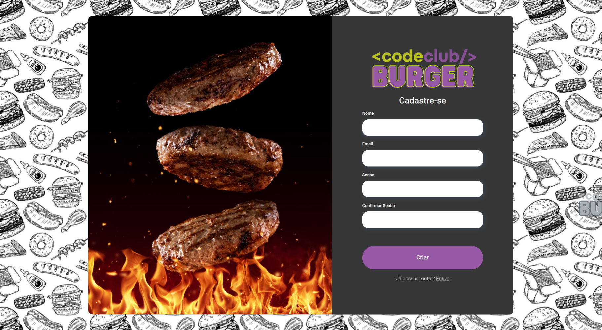
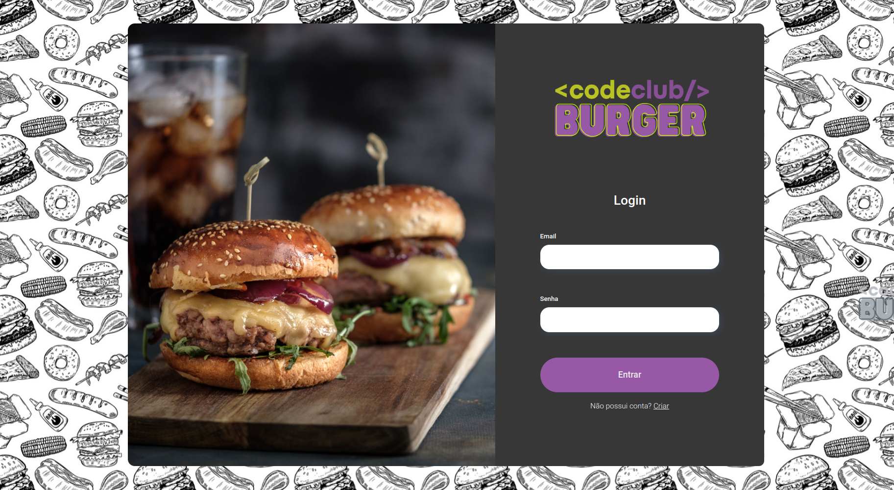
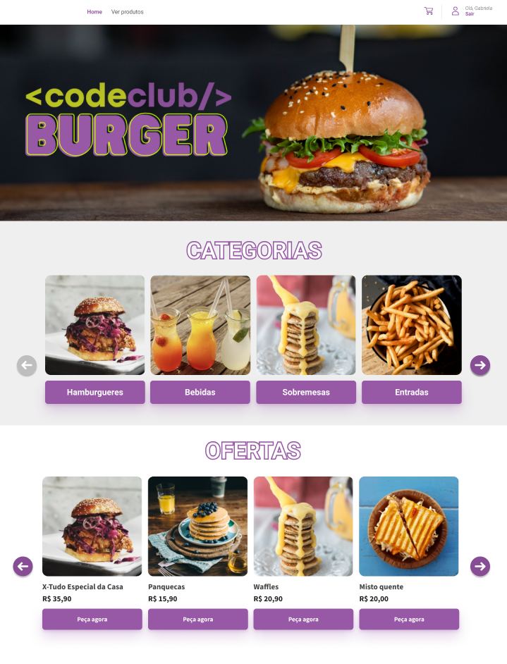
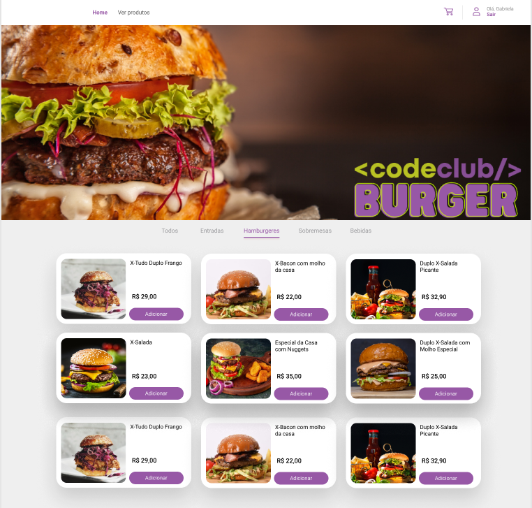
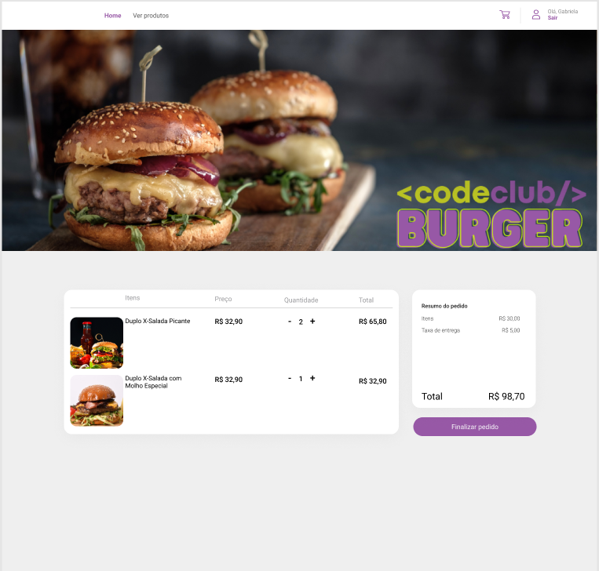
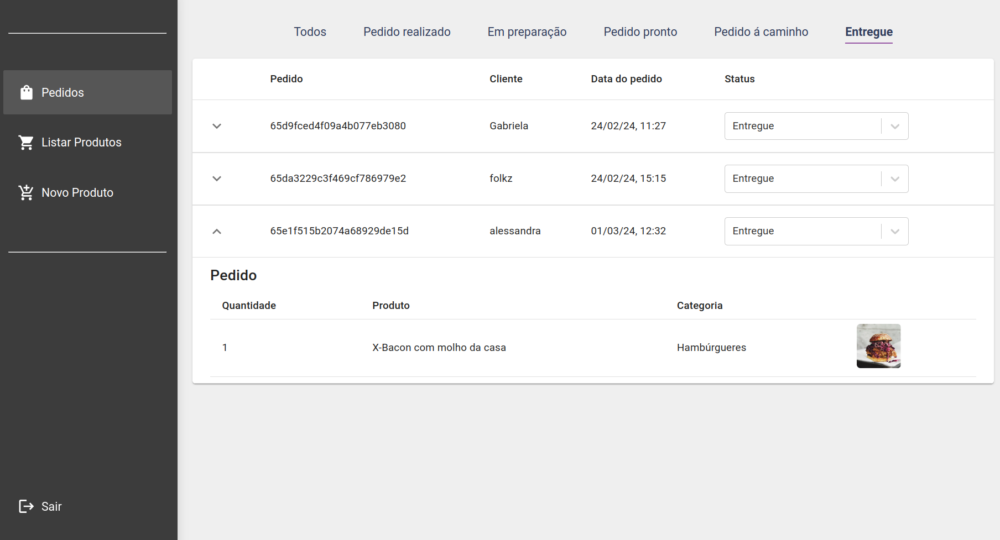
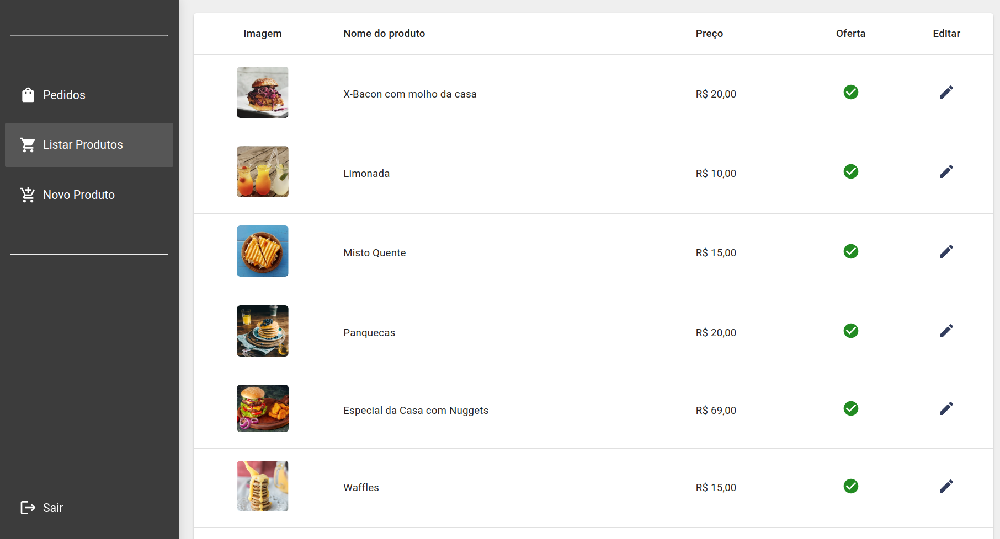
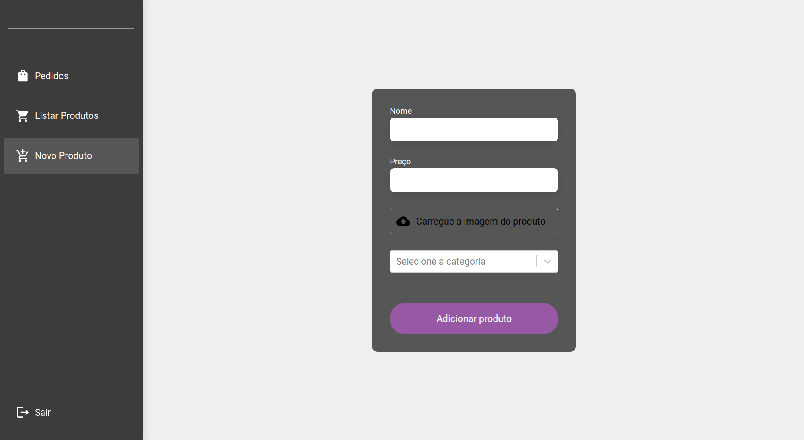

# Backend do Projeto CodeBurger

Este é o backend do projeto CodeBurger, responsável por fornecer uma API para gerenciar usuários, produtos, categorias e pedidos.
O backend está configurado para utilizar um banco de dados PostgreSQL para usuários, produtos e categorias, e um banco de dados MongoDB para armazenamento de pedidos.

## Tecnologias Utilizadas

- Node.js
- Express.js
- Sequelize (ORM para PostgreSQL)
- Multer (para upload de arquivos)
- JWT (Autenticação via tokens)
- bcrypt (Para hash de senhas)
- MongoDB (para armazenamento de pedidos)

## Endpoints da API

1. **Usuários**
   - **POST /users**: Cadastra um novo usuário. Requer dados como `name`, `email` e `password`.
   - **POST /sessions**: Realiza autenticação de usuários e gera um token JWT.

2. **Produtos**
   - **POST /products**: Cadastra um novo produto. Requer autenticação de administrador e permite upload de imagem.
   - **GET /products**: Retorna todos os produtos cadastrados.
   - **PUT /products/:id**: Atualiza os dados de um produto existente.

3. **Categorias**
   - **POST /categories**: Cadastra uma nova categoria de produto.
   - **GET /categories**: Retorna todas as categorias cadastradas.
   - **PUT /categories/:id**: Atualiza os dados de uma categoria existente.

4. **Pedidos**
   - **POST /orders**: Cria um novo pedido com os produtos selecionados.
   - **GET /orders**: Retorna todos os pedidos cadastrados.
   - **PUT /orders/:id**: Atualiza o status de um pedido existente.
   
## Repositório Front-end

[Repositório Front-end](https://github.com/gabrielabade/codeburger-frontend.git)

## Deploy

O front-end do projeto CodeBurger está disponível no seguinte link: [CodeBurger - Deploy](https://codeburger-gabrielabade.vercel.app/login)

## Preview

### Painel Cliente

### Painel Administrador

